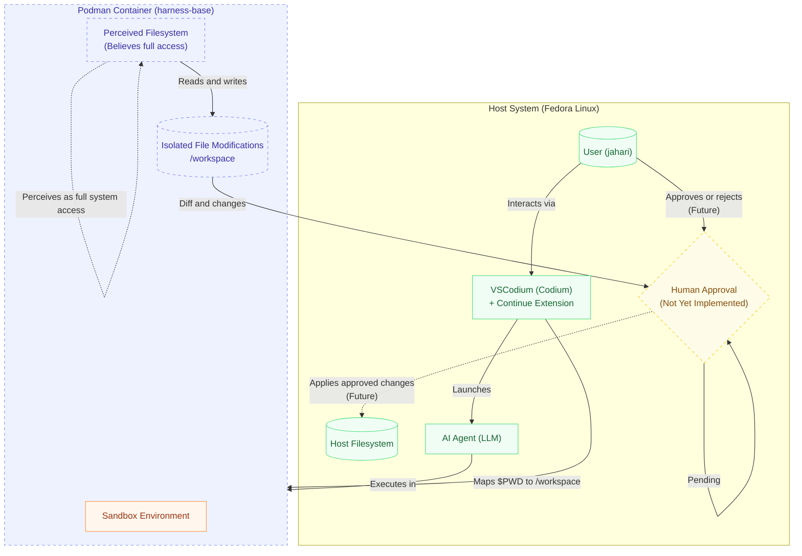

Project Setup Summary
Project Name: Local + Cloud Agent Harness

Objective: A bash-based harness to abstract LLM API calls (Groq, OpenRouter, Google) for use by local agents. It handles provider-specific JSON formatting, API key management, and response parsing.

File Structure:

text

.
├── Data/
│   └── api_keys.sh
└── System/
    └── harness.sh
1. Configuration File (Data/api_keys.sh)
Exports environment variables for the providers.

```bash
export OPENROUTER_KEY="your_openrouter_key"
export GROQ_KEY="your_groq_key"
export GOOGLE_KEY="your_google_key"
```

2. Main Harness (System/harness.sh)

Dependencies: bash, curl, jq.
Usage: ./System/harness.sh <provider> <system_prompt> <user_prompt> [temperature] [--raw]
Features:
Supports groq, openrouter, google.
Enforces max_tokens (1000) to respect free tier limits.
Defaults temperature to 0.7.
Includes --raw flag to return full JSON response; otherwise, extracts clean text content.
Includes error message fallback in output parsing.
Code: [[harness.sh]]

In ~/.config/VSCodium/User/settings.json, Codium is configured to launch a specific script when opening a terminal.

The setting points to this script:
/home/jahari/.local/bin/harness-shell

---

Project Documentation: Agent Harness System
Project Name: codenameButler
Project Type: Local + Cloud Agent Harness System
Environment: Fedora Linux (Host) / Podman (Container Runtime) / VSCodium with Continue Extension (IDE)

1. System Overview
The system aims to create a sandboxed execution environment for AI agents. Agents operate within a Podman container, believing they have full system access. In reality, file modifications are isolated. A human approval mechanism (not yet implemented) will review changes before applying them to the host system. Currently, the system is in a "proto-system" development phase.




1. Architecture & Components
2.1 Host Environment

OS: Fedora Linux
User: jahari
Runtime: Podman
IDE: VSCodium (Codium)
Extension: Continue
2.2 Container Environment

Base Image: registry.fedoraproject.org/fedora:44 (referenced as harness-base)
Shell: bash-5.3
User Mapping: --userns=keep-id (Container user jahari maps to Host user jahari)
Status: Minimal installation. Missing critical dependencies (curl, jq). sudo access is disabled.
2.3 Agent Logic (Current Proto-System)

Script: System/harness.sh
Function: Handles API communication with LLM providers (Groq, OpenRouter, Google). Uses jq for JSON payload generation and curl for requests.
Dependency: Relies on Data/api_keys.sh for credentials.
3. File Manifest
File Path
Purpose
~/Documents/Iguana Sea/ideas/codenameButler/System/harness.sh	Main execution script for LLM API calls.
~/Documents/Iguana Sea/ideas/codenameButler/Data/api_keys.sh	Stores API keys (OPENROUTER_KEY, GROQ_KEY, GOOGLE_KEY).
/home/jahari/.local/bin/harness-shell	Podman launcher script invoked by Codium terminal profile.
~/.config/VSCodium/User/settings.json	Codium configuration file defining terminal profiles.
~/.continue/config.yaml	Continue extension configuration for LLM providers.

4. Configuration Details
4.1 Codium Terminal Profile

Location: ~/.config/VSCodium/User/settings.json
Profile Name: harness-shell
Execution: Runs /home/jahari/.local/bin/harness-shell
Default Profile: harness-shell (Auto-opens in new terminals)
4.2 Podman Launcher Script (harness-shell)

Location: /home/jahari/.local/bin/harness-shell
Logic:
Checks if container harness-default exists.
If not, creates container with image harness-base and mounts current directory ($PWD) to /workspace.
Executes podman exec -it harness-default bash.
Current Defect: Container name harness-default is static. If created in Directory A, opening a terminal in Directory B reuses the container (showing Directory A files).
4.3 Continue LLM Configuration

Location: ~/.continue/config.yaml
Providers Configured: Ollama (Local), Anthropic, OpenAI.
5. Current Status
Container Image (harness-base):
State: Base Fedora 44 image.
Installed: bash.
Missing: curl, jq, git.
Constraint: Cannot install via sudo inside container.
Mounting/Mount Points:
Mapping: Host $PWD -> Container /workspace.
State: Functional but rigid due to static container name.
Script Execution:
Host: System/harness.sh executes successfully.
Container: Blocked (Missing curl and jq).
6. Required Actions & Modifications
6.1 Modify Launcher Script (/home/jahari/.local/bin/harness-shell)

Objective: Enable dynamic container naming per project folder.
Change: Update line 2.

```bash
    Current: SESSION_NAME="${HNESS_SESSION:-harness-default}"
    Required: SESSION_NAME="${HNESS_SESSION:-harness-$(basename $PWD)}"
```
Outcome: Generates unique containers (e.g., harness-codenameButler) allowing correct mounting for different projects.
6.2 Build New Container Image

Objective: Create harness-base-tools image including dependencies.
Required File: Containerfile (to be created).
Dependencies: curl, jq.
Base: registry.fedoraproject.org/fedora:44.
6.3 Update Launcher Script (Image Reference)

Objective: Point script to new image.
Change: Update line 7 in harness-shell.
Current: harness-base
Required: harness-base-tools
6.4 Integration Testing

Verify System/harness.sh execution inside container.
Verify file access/mounting.

